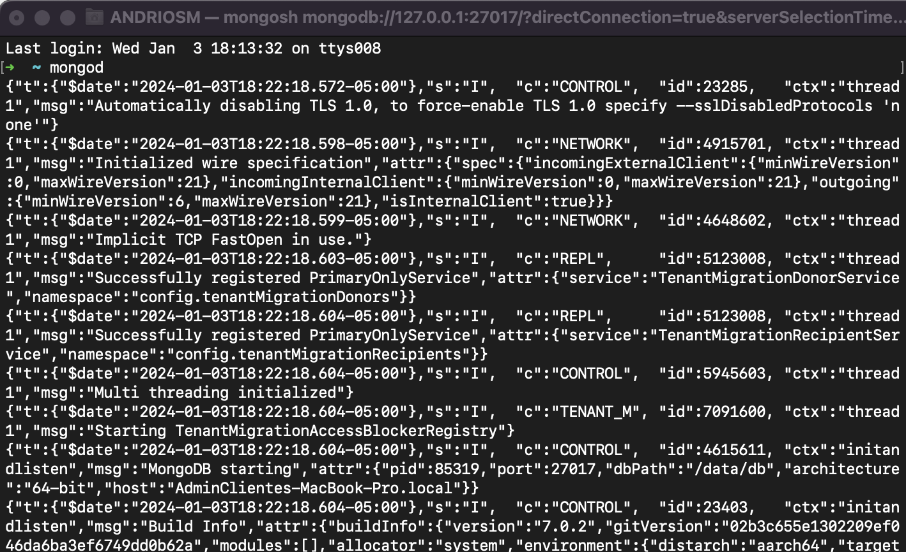
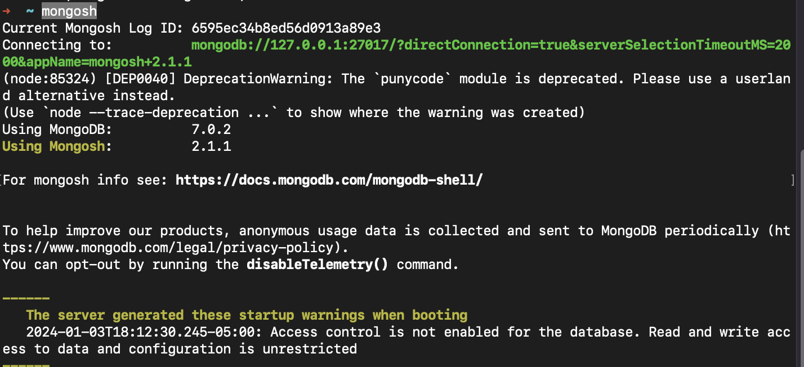
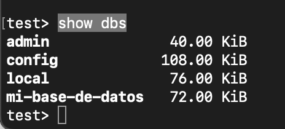

# __*GRAPHQL SERVER SETUP:*__ 

# __*Run The MongoDB Service:*__ 

## Run, stop and restart the MongoDB service: 
```shell
$ brew services start mongodb-community
```
If everything is ok you should see something like this: 

```shell
➜  graphQL_Mongo brew services start mongodb-community
==> Successfully started `mongodb-community` (label: homebrew.mxcl.mongodb-community)
```

## Other commands to interact with MongoDB server: 

```shell
$ brew services stop mongodb-community
$ brew services restart mongodb-community
```

- If you need to check if the MongoDB is running, you can check this link in any browser: 
```text
http://localhost:27017/
```

## Open the MongoDB COMPASS using a link in the browser:
```shell
$ mongodb://localhost:27017/mi-base-de-datos
```
___
# __*Run the GraphQL Server.*__ 

- You can use the command line: 
```shell
$ node server.js  
```
- Another option to run the server is: (According to the package.json)

```shell
$ npm run server
```
## URL to run the GraphQL Server: 

```text
http://localhost:4000/graphql
```

# How to run the MongoDB on the terminal 

- In a new mac terminal you should write: 
```shell
$ mongod
```
And you should see a log with a new Mongodb execution

- Something like this. 



- After adding this you can interact with mongodb using this command line. 

```shell
$ mongosh
```

And after this you should see something like this. 



- After this you can write any mongodb command to interact with it. 

Example:

```shell
$ show dbs
```
This command line should show the active data base on your system 




👌