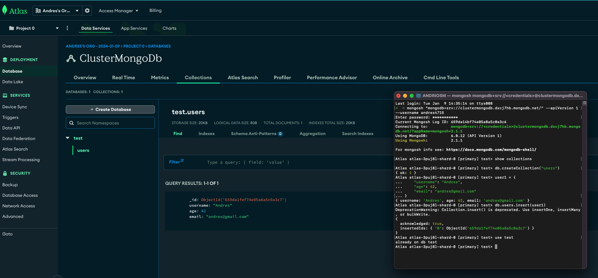

# MongoDb

## Personal Atlas account: andres4715
[atlas account](https://cloud.mongodb.com/v2/659d9b19e52b53722651c971#/metrics/replicaSet/659d9c21a8eb4d1ad8b88c7d/explorer/test/users/find)

```text
User: andres4715
pass: adriosm2010
```

## Cluster:
```text
clustermongodb.dxcj7hb.mongodb.net
```

Run your connection string in your command line

```shell
$ mongosh "mongodb+srv://clustermongodb.dxcj7hb.mongodb.net/" --apiVersion 1 --username andres4715
```

